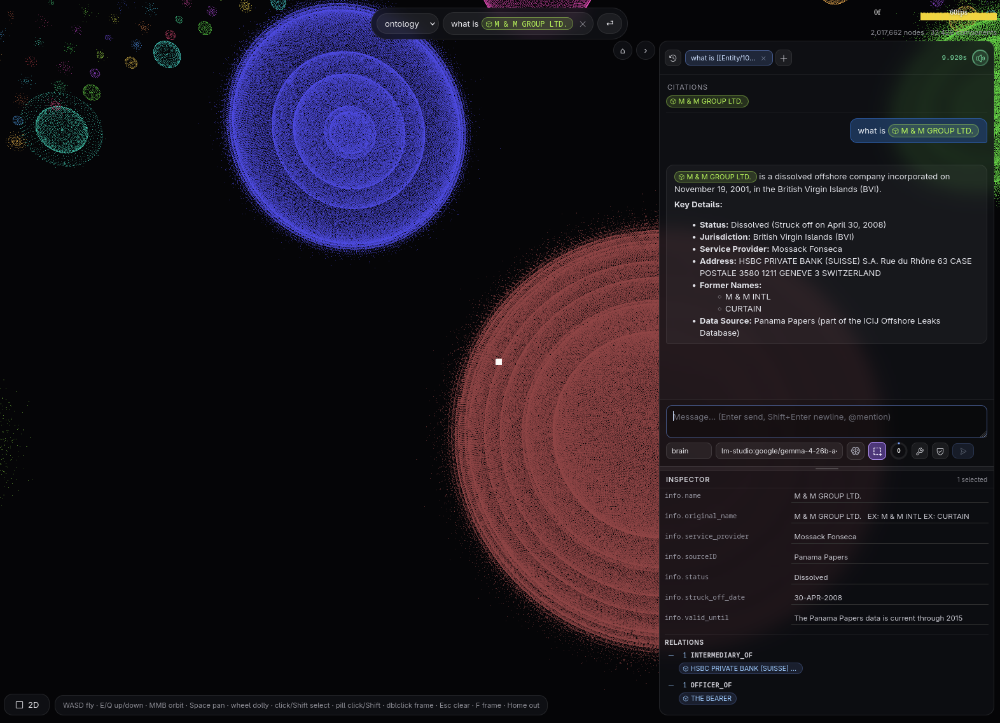

<!-- LOGO -->
<h1>
<p align="center">
  
</h1>
  <p align="center">
    📖 <a href="https://mikesmullin.github.io/brain/">Documentation</a> 👈
    ·
    <a href="https://mikesmullin.github.io/brain/#quickstart">Quick start</a>
    ·
    <a href="https://mikesmullin.github.io/brain/#server">The server</a>
    ·
    <a href="https://mikesmullin.github.io/brain/#query">Query modes</a>
    ·
    <a href="https://mikesmullin.github.io/brain/#viz">Viz</a>
    ·
    <a href="https://mikesmullin.github.io/brain/#benchmark">Benchmark</a>
    ·
    <a href="https://mikesmullin.github.io/brain/#mcp">MCP</a>
  </p>
</p>

# 🧠 Brain

**A knowledge graph that lives in your repo — typed, searchable, and fast at millions of nodes.**

Pile enough notes, docs, and facts into a folder and eventually you want to *ask questions* of
them — "which on-call engineer supports the payments service?" — not just grep for keywords. The
usual options all disappoint: a vector store hands back fuzzy text with no structure; a raw LLM
agent let loose on your files blows its context window, invents duplicates and schema-invalid
junk; a hosted knowledge base drags your proprietary data into someone else's cloud. You end up
with either **no structure or no trust**.

`brain` gives you both, and keeps it fast. Your knowledge lives as plain Markdown files — one
typed entity per file, git-friendly, human-editable, yours — validated on **every write** against
an entity-component-system ontology, so the graph can't drift into inconsistency. A resident
server holds the indexed graph in memory and answers in **milliseconds at 2M+ nodes**
([measured](docs/BENCHMARK.md)): hybrid vector + keyword search, deterministic multi-hop
traversal, grounded LLM synthesis, a real-time WebGL explorer of the whole graph, and the same
typed tool surface for AI agents over [MCP](https://modelcontextprotocol.io) — all local, no
external services, your data never leaves the machine.

<p align="center">
  
</p>

## Quick start

Run a CLI query:

```bash
bun install && bun link          # register the global `brain` command
brain init && brain reindex && brain server start &
brain search "anything"          # also: think · ontology · graph · graphql
```

Load the playground dataset (the [Panama Papers](docs/BENCHMARK.md) — 2M nodes, 2.9M edges):

```bash
curl -LO https://offshoreleaks-data.icij.org/offshoreleaks/csv/full-oldb.LATEST.zip && unzip full-oldb.LATEST.zip -d raw
bun tools/etl-panama.mjs ./raw ./panama && cd panama
brain reindex --no-embed && brain server start &
```

Explore it in the browser:

```bash
brain viz                        # → http://127.0.0.1:4321
```

## Inspiration

- [Evokoa/pgGraph](https://github.com/Evokoa/pgGraph) — studying their CSR-based PostgreSQL graph engine inspired brain's client/server architecture, bounded-traversal `capped` semantics, maintenance-gated index rebuilds, and the head-to-head [Panama Papers benchmark](docs/BENCHMARK.md).
- [msmullin/memo](https://github.com/mikesmullin/memo)
- [msmullin/ontology](https://github.com/mikesmullin/ontology)
- [garrytan/gbrain](https://github.com/garrytan/gbrain)
